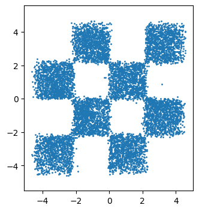

### Overview
I play with diffusion/consistency models here.

### TODO List
- [x] Training the score net for toy data
- [x] Training the score net for CIFAR 10
- [x] Enable Distributed Data Parallel
- [x] Evaluate FID for CIFAR 10
- [ ] Evaluate likelihood
- [x] Consistency Distillation for toy data
- [ ] Consistency Training
- [ ] Adversarial Diffusion Distillation
- [ ] Progressive Distillation
- [ ] UFOGen

### Current Results
The output of the Heun solver with 20 steps:

