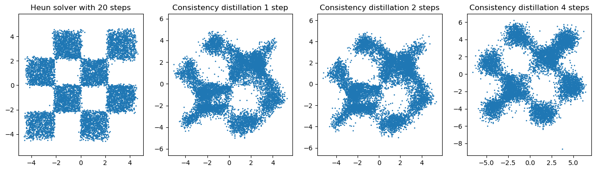

### Overview
I play with diffusion/consistency models here.

### TODO List
- [x] Training the score net for toy data
- [x] Training the score net for CIFAR 10
- [x] Enable Distributed Data Parallel
- [x] Evaluate FID for CIFAR 10
- [ ] Evaluate likelihood
- [x] Consistency Distillation for toy data
- [x] Multi-step generation with consistency model
- [ ] Consistency Training
- [ ] Consistency Trajectory Model
- [ ] Adversarial Diffusion Distillation
- [ ] Progressive Distillation
- [ ] UFOGen

### Current Results
Temperal results:

Results from the Heun solver and consistency distillation with different steps.

